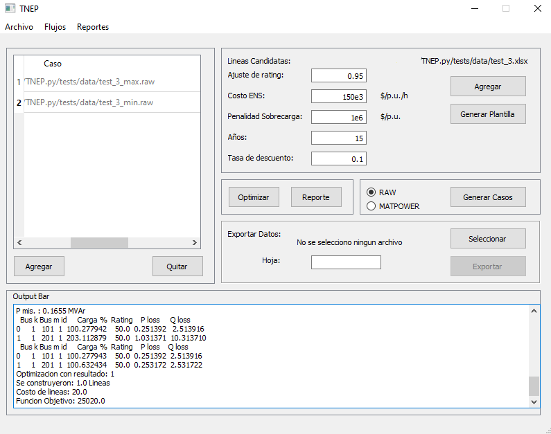

# TNEP.py

Este paquete sirve para realizar optimizaciones para la planificacion de la expansion del sistema de transmisión. El cual fue presentado en el (2021 IEEE CHILE COM)[https://doi.org/10.1109/CHILECON54041.2021.9703011]

```
@INPROCEEDINGS{9703011,
  author={Barbería, Juan Luis and Tomas Anello, Mariano and del Rosso, Alberto},
  booktitle={2021 IEEE CHILEAN Conference on Electrical, Electronics Engineering, Information and Communication Technologies (CHILECON)}, 
  title={Computational Tool for Optimal Expansion of Transmission Networks}, 
  year={2021},
  volume={},
  number={},
  pages={1-5},
  doi={10.1109/CHILECON54041.2021.9703011}}
```

La presentacion del trabajo pueden encontrarlos dentro del repositorio en `slides.pdf`.





# Instalación
La instalación se realiza de la siguiente manera:
```
git clone https://github.com/jbarberia/TNEP.py
cd TNEP.py
pip install -r requirements.txt
python setup.py install
```

NOTA: Es aconsejable utilizar la versión 3.6 del interprete de python, de esta manera se evita cualquier tipo de incopatibilidades con las dependencias.

# Uso

Para utilizar la interfaz grafica se puede correr el script de inicialización que se encuentra en la carpeta `tnep`:

```
python tnep\main.py
```

Tambien este paquete admite un uso dentro de scripts. Dentro de `tests\test_tnep.py` hay varios ejemplos de su utilización.


```python
from tnep import Parser, Parameters, TNEP

# Get cases
parser = Parser()
cases = [data_path + 'Mendoza.raw']
nets = list(map(parser.parse, cases))

# Get parameters
parameters = Parameters()
parameters.read_excel(data_path + 'Mendoza.xlsx')

# Solve model
model = TNEP()
nets_solved, results = model.solve(nets, parameters)
```
